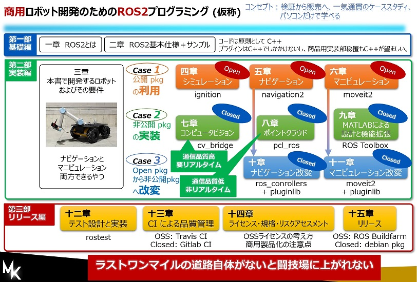

# ros2_book_commercialize_project_jp
「商用ロボット開発のためのROS2プログラミング」プロジェクト用のワイガヤリポジトリ

## コンセプト図

## 方針
- まずは情報共有をします。困りごと等をissueで収集するところからスタートします。
- ROS2の動向は見守りながら、現状議論できるところから少しずつやっていきましょう。
- ワイガヤしながら楽しくコンテンツを追加していきましょう。思いついた順番で構いません。まずは気軽にトークしましょう。
- 当人はほぼ無知ですので、コンサルはできません。一緒にソリューションを見つけていきましょう。

## コンテンツ（仮）
### 第一部：基礎編
1. ROS2 とは
2. ROS2 基本仕様+サンプル
3. ロボットの要件
### 第二部：実装編
4. シミュレーション
5. ナビゲーション
6. マニピュレーション
7. コンピュータビジョン
8. ポイントクラウド
9. MATLABによる設計と機能拡張
10. ナビゲーションの改変
11. パスプランナの改変
### 第三部：リリース編
12. テスト設計と実装
13. CI による品質管理
14. ライセンス・規格・リスクアセスメント
15. リリース
